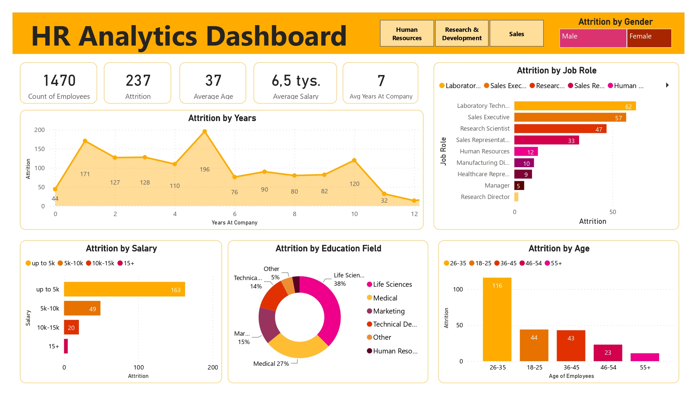

# HR Analytics Dashboard 

## General info
The project contains the analysis of employee attrition data and create an interactive dashboard using Power BI.

The aim of the project is analysis of employees attrition data in example company to find out reasons which are most responsible for attrition. The dashboard is designed to help the HR team to interpreting data and analyzing the key factors to reduce the attrition rate. 

### Dataset
The dataset contains the details of the employee attrition (HR Employee Attrition) such as department, age, education field, job role, years at company etc. It comes from Kaggle and can be find [here](https://www.kaggle.com/datasets/itssuru/hr-employee-attrition). 

### Project includes:
- HR dashboard with Power BI - **HR_analytics.pbix**
- view the dashboard - HR_dashboard.jpg, HR_dashboard.pdf.

### Technologies
The project is created with:
- Power BI.

**Running the project:**

To use the dashboard:
- clone the repository or download .pbix file;
- open the file in Power BI Desktop;
- use the slicers to filter data by Department or other indicators.

### HR analytics dashboard view:

